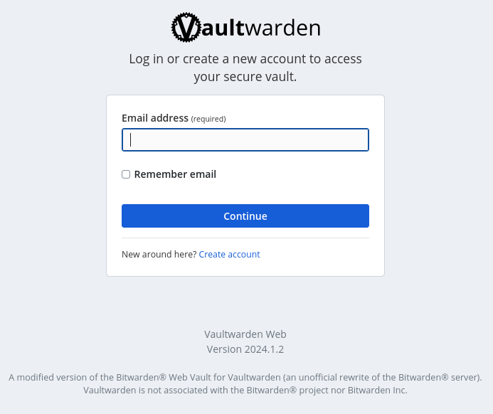
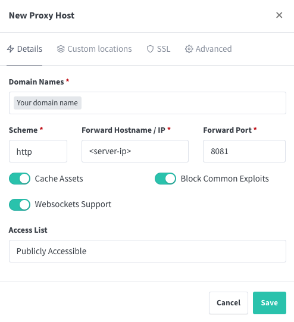
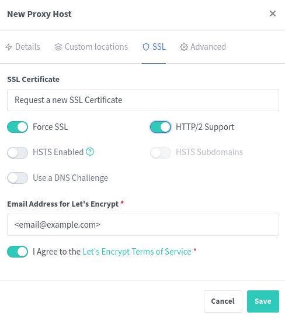

## How deploy a self-hosted Vaultwarden (Bitwarden) server with Docker

This guide will show you how to deploy a self-hosted Vaultwarden server with Docker on a Linux server usgin the NGINX Proxy Manager as a reverse proxy.



### Prerequisites

- Docker

```bash
curl -fsSL https://get.docker.com -o get-docker.sh
sudo sh get-docker.sh
```

### Docker Compose File

Use the `docker-compose.yml` file present in this repository to deploy the Vaultwarden server. You just need to change the `.env` files with your own values.

1. Create a new directory for the Vaultwarden data and configuration files.

```bash
sudo mkdir -p /opt/vw
```

```bash
mkdir vaultwarden
cd vaultwarden
```

2. Clone the repository.

```bash
git clone https://https://github.com/Rapha-Borges/deploy-vaultwarden.git .
```

3. Create the ADMIN Token using a temporary container

```
docker run --rm -it vaultwarden/server /vaultwarden hash
```

Insert your password and copy the token generated to the `.env` file. E.g.:

```bash
VAULTWARDEN_ADMIN_TOKEN='$argon2id$v=19$m=65540,t=3,p=4$eE4WeLxol1ODKg/1EZF6vN6xaKkbStz+6aMalproaC0$7UZak49fRr3r/tK63DLgnSlzIFoEHyk0tFhfETcTe3E'
```

Save your password in a safe place. You will need it to access the admin panel.

4. Validate and personalize the Vaultwarden Backup `.env` file present at `vaultwarden/.env`.

### Configure the Backup

This `docker-compose.yml` file has a backup service that will create a backup of the Vaultwarden server using `rclone` to upload to a cloud storage.

Run the `rclone` container configuration and follow the instructions to configure the server.

#### IMPORTANT: The remote name default must be `BitwardenBackup`. If you want to use another name, set this at the `.env` file.

```bash
docker run --rm -it \
  --mount type=volume,source=vaultwarden-rclone-data,target=/config/ \
  ttionya/vaultwarden-backup:latest \
  rclone config
```

### Start the Vaultwarden server.

```bash
docker compose up -d
```

6. Access the Vaultwarden server using the server IP.

### NGINX Proxy Manager and SSL

To access all features of the Vaultwarden server, you need to use a TLS certificate. We will use the NGINX Proxy Manager present at the docker compose file to create a reverse proxy and manage the SSL certificate.

1. Access the NGINX Proxy Manager web interface.

```
HTTP:       http://<server-ip>:81
Email:      admin@example.com
Password:   changeme
```

2. Create a new proxy host.

```
http://<server-ip>:81/nginx/proxy
```

3. Fill the form as the images below.





4. Access the Vaultwarden server using the domain name. Now you should see the SSL certificate and be able to use all the features of the Vaultwarden server.

### Configure the Vaultwarden server

1. Access the Vaultwarden server admin panel.

```
https://<domain-name>/admin
```

2. Use the same password used to generate the ADMIN token.

3. Change at least this following settings:

#### General Settings
- Domain URL: `https://<domain-name>`
- Allow invitations: [x] Default: true

### Adding users

1. Access the Vaultwarden server admin panel.

```
https://<domain-name>/admin
```

2. Go to the `Users` tab

3. Invite a new user using the email.


4. Just create a new account using the email at `https://<domain-name>`

### Setting the time zone

Some users may have problems with the time zone even after setting the time zone at the `.env` file. The following steps can be used to set the time zone manually.

1. Set the host time zone.

```bash
sudo timedatectl set-timezone <time-zone>
```

2. Restart the Vaultwarden server.

```bash
docker compose restart
```

3. Check the date and time at the `ttionya/vaultwarden-backup` container:

```bash
docker exec vaultwarden-backup-1 date
```

If the time is not correct, follow the next steps.

4. Access the `vaultwarden-backup` container.

```bash
docker exec -it vaultwarden-backup-1 /bin/sh
```

5. Set the time zone at the container.

```bash
apk add tzdata
cp /usr/share/zoneinfo/<time-zone> /etc/localtime
echo "<time-zone>" > /etc/timezone
date
```


## References

- [Vaultwarden GitHub Repository](https://github.com/dani-garcia/vaultwarden)
- [Vaultwarden Backup](https://github.com/ttionya/vaultwarden-backup)
- [OPENTAQ YouTube Video](https://www.youtube.com/watch?v=v_7vJDwGWug&t=326s&ab_channel=OPENTAQ)